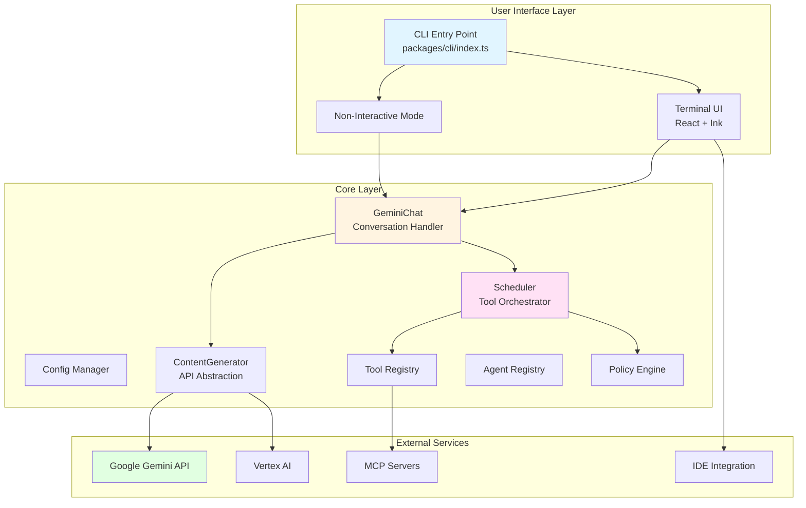
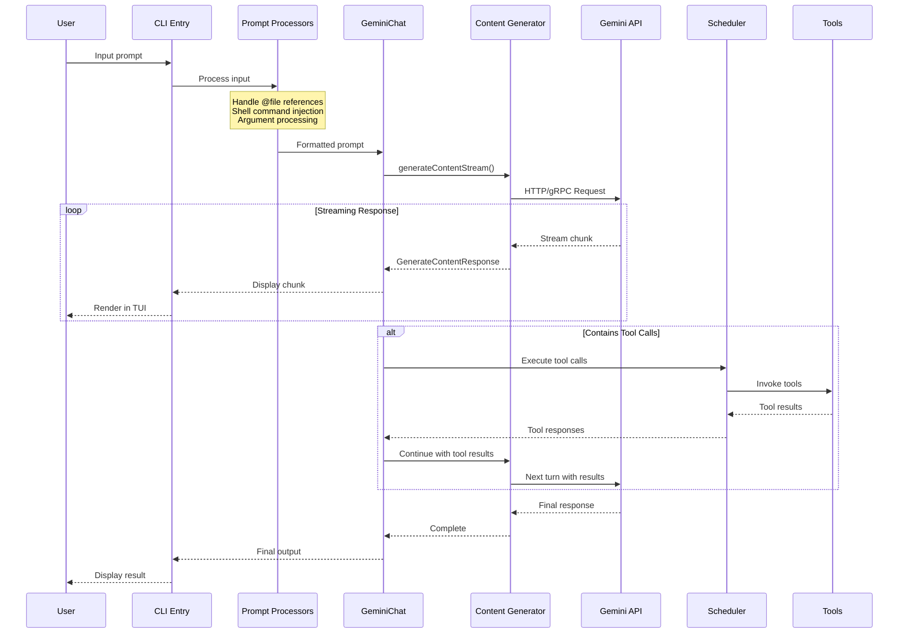
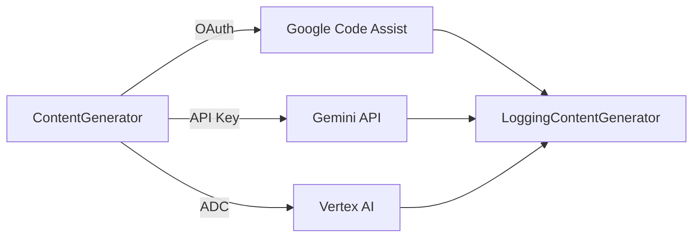
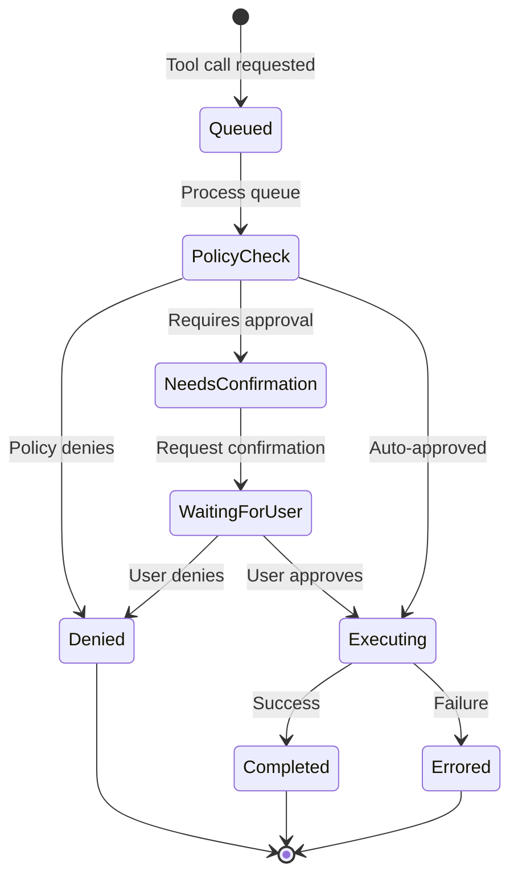
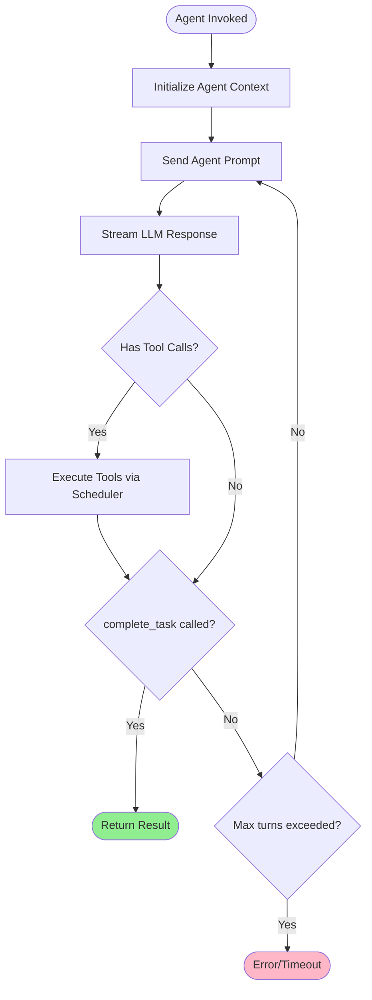
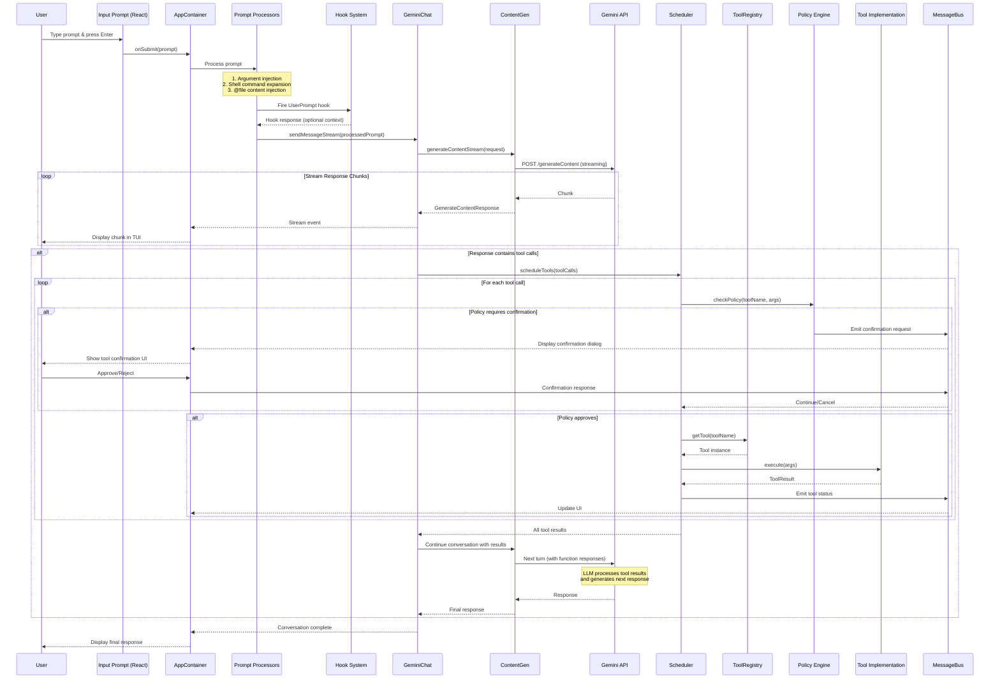
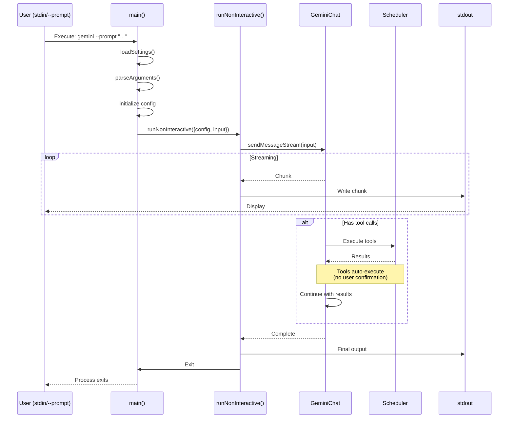
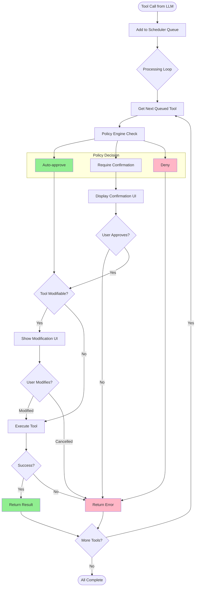
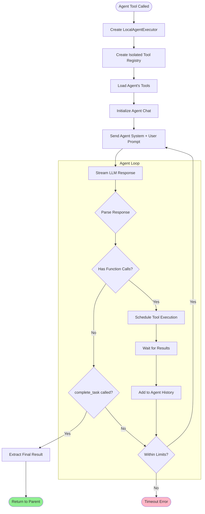

# Gemini CLI - Architecture & Flow Analysis

## Table of Contents
1. [High-Level Architecture](#high-level-architecture)
2. [Message & Invocation Flow](#message--invocation-flow)
3. [Key Components](#key-components)
4. [Design Decisions](#design-decisions)
5. [Package Structure](#package-structure)
6. [Detailed Flow Diagrams](#detailed-flow-diagrams)

---

## High-Level Architecture

Gemini CLI is a monorepo-based TypeScript application that provides an interactive terminal interface for communicating with Google's Gemini AI models.



---

## Message & Invocation Flow

### User Prompt → LLM Response Flow



---

## Key Components

### 1. Entry Point & Initialization
**File:** `packages/cli/index.ts:9` → `packages/cli/src/gemini.tsx:318`

The main entry point handles:
- Global error handling
- Process cleanup
- Delegates to `main()` function

```typescript
// Simplified flow
main() {
  1. Load settings & configuration
  2. Parse CLI arguments
  3. Setup authentication
  4. Handle sandbox (if enabled)
  5. Initialize app (tools, agents, policies)
  6. Start UI (interactive) OR run non-interactive
}
```

### 2. GeminiChat - Conversation Manager
**File:** `packages/core/src/core/geminiChat.ts`

Manages the conversation lifecycle:
- Maintains conversation history
- Handles streaming responses
- Implements retry logic for failures
- Validates content from LLM
- Manages turn compression

**Key Methods:**
- `sendMessage()` - Send user message to LLM
- `sendMessageStream()` - Stream LLM responses
- `extractCuratedHistory()` - Clean invalid turns from history

### 3. ContentGenerator - API Abstraction
**File:** `packages/core/src/core/contentGenerator.ts`

Abstracts authentication methods:
- **OAuth (Login with Google)** - `AuthType.LOGIN_WITH_GOOGLE`
- **API Key** - `AuthType.USE_GEMINI`
- **Vertex AI** - `AuthType.USE_VERTEX_AI`
- **Compute Default Credentials** - `AuthType.COMPUTE_ADC`



### 4. Scheduler - Tool Execution Orchestrator
**File:** `packages/core/src/scheduler/scheduler.ts:84`

Event-driven orchestrator for tool execution:



**States:**
- `Queued` - Tool call received
- `Validating` - Policy engine checking
- `Executing` - Tool running
- `Completed` - Success
- `Errored` - Failed

### 5. Tool Registry
**File:** `packages/core/src/tools/tool-registry.ts`

Manages all available tools:
- Built-in tools (Read, Write, Edit, Bash, Grep, Glob, etc.)
- MCP (Model Context Protocol) tools
- Custom extension tools
- Agent tools (subagents)

**Built-in Tools:**
- `Read` - Read files (`packages/core/src/tools/read-file.ts`)
- `Write` - Write files (`packages/core/src/tools/write-file.ts`)
- `Edit` - Edit files (`packages/core/src/tools/edit.ts`)
- `Bash` - Execute shell commands (`packages/core/src/tools/shell.ts`)
- `Grep` - Search content (`packages/core/src/tools/grep.ts`)
- `Glob` - Find files by pattern (`packages/core/src/tools/glob.ts`)
- `WebFetch` - Fetch web content (`packages/core/src/tools/web-fetch.ts`)
- `WebSearch` - Search the web (`packages/core/src/tools/web-search.ts`)

### 6. Agent Executor
**File:** `packages/core/src/agents/local-executor.ts:91`

Executes agent loops (subagents):
- Creates isolated tool registry per agent
- Manages agent-specific conversation
- Enforces turn limits & timeouts
- Requires `complete_task` tool call to finish



### 7. Policy Engine
**File:** `packages/core/src/policy/`

Controls tool access and behavior:
- Approval modes: `auto`, `prompt`, `reject`
- Tool-specific policies
- Pattern matching for file operations
- Integrates with MessageBus for decisions

---

## Design Decisions

### 1. **Monorepo Architecture**
- **Packages:**
  - `core` - Business logic, tools, agents
  - `cli` - User interface, TUI components
  - `sdk` - Extension development SDK
  - `a2a-server` - Agent-to-agent server
  - `vscode-ide-companion` - VSCode extension

**Rationale:** Enables code sharing while maintaining separation of concerns.

### 2. **Event-Driven Architecture (MessageBus)**
**File:** `packages/core/src/confirmation-bus/message-bus.ts`

Components communicate via events:
- Tool confirmation requests
- Policy updates
- User feedback
- Console logs

**Benefits:**
- Loose coupling
- Easy to extend
- Supports async workflows

### 3. **React + Ink for TUI**
**File:** `packages/cli/src/ui/App.tsx`

Uses React components for terminal UI:
- Declarative UI updates
- Component reusability
- Familiar React patterns

**Components:**
- `AppContainer` - Root component
- `ChatHistory` - Message display
- `InputPrompt` - User input
- `ToolExecutionDisplay` - Tool call visualization

### 4. **Streaming by Default**
All LLM interactions use streaming:
- Better UX (immediate feedback)
- Supports long-running responses
- Enables real-time tool execution

### 5. **Sandboxing Support**
**File:** `packages/cli/src/utils/sandbox.js`

Optional Docker/Podman sandboxing:
- Isolates tool execution
- Enhanced security
- Clean environment per session

### 6. **Prompt Processing Pipeline**
**Files:** `packages/cli/src/services/prompt-processors/`

Multi-stage processing:
1. **Argument Processor** - CLI arguments
2. **Shell Processor** - Command injection
3. **@File Processor** - File content injection
4. **Injection Parser** - Special syntax

### 7. **Compression & Context Management**
**File:** `packages/core/src/services/chatCompressionService.ts`

Manages token limits:
- Compresses old turns when needed
- Preserves recent context
- Maintains conversation coherence

### 8. **Extension System**
**File:** `packages/cli/src/config/extension-manager.ts`

Supports extensions via:
- Custom tools
- Custom agents
- Themes
- Hooks (SessionStart, SessionEnd, etc.)
- MCP servers

---

## Package Structure

```
gemini-cli/
├── packages/
│   ├── core/                    # Core business logic
│   │   ├── src/
│   │   │   ├── agents/          # Agent execution (local-executor, registry)
│   │   │   ├── core/            # Core APIs (geminiChat, contentGenerator)
│   │   │   ├── scheduler/       # Tool orchestration
│   │   │   ├── tools/           # Tool implementations
│   │   │   ├── policy/          # Policy engine
│   │   │   ├── hooks/           # Hook system
│   │   │   ├── mcp/             # MCP client
│   │   │   ├── services/        # Shared services
│   │   │   ├── config/          # Configuration management
│   │   │   └── utils/           # Utilities
│   │
│   ├── cli/                     # CLI interface
│   │   ├── src/
│   │   │   ├── ui/              # React TUI components
│   │   │   │   ├── components/  # Reusable components
│   │   │   │   ├── contexts/    # React contexts
│   │   │   │   └── hooks/       # Custom hooks
│   │   │   ├── config/          # CLI-specific config
│   │   │   ├── services/        # Prompt processors, command loaders
│   │   │   ├── utils/           # CLI utilities
│   │   │   ├── gemini.tsx       # Main entry point
│   │   │   └── nonInteractiveCli.ts  # Non-interactive mode
│   │
│   ├── sdk/                     # Extension SDK
│   ├── a2a-server/              # Agent-to-agent communication
│   ├── vscode-ide-companion/    # VSCode extension
│   └── test-utils/              # Testing utilities
```

---

## Detailed Flow Diagrams

### Complete Request Flow (Interactive Mode)



### Non-Interactive Mode Flow



### Tool Execution Flow (Detailed)



### Agent Execution Flow



---

## Key Code Navigation Guide

### To understand user input processing:
1. Start at `packages/cli/src/gemini.tsx:318` (main function)
2. For interactive: `packages/cli/src/ui/AppContainer.tsx` (React UI)
3. For non-interactive: `packages/cli/src/nonInteractiveCli.ts:58`
4. Prompt processing: `packages/cli/src/services/prompt-processors/`

### To understand LLM communication:
1. `packages/core/src/core/geminiChat.ts` - Main chat handler
2. `packages/core/src/core/contentGenerator.ts:133` - API abstraction
3. Authentication: `packages/core/src/core/contentGenerator.ts:51-57` (AuthType enum)

### To understand tool execution:
1. `packages/core/src/scheduler/scheduler.ts:84` - Scheduler class
2. `packages/core/src/tools/tool-registry.ts` - Tool management
3. Individual tools: `packages/core/src/tools/*.ts`
4. Policy engine: `packages/core/src/policy/`

### To understand agent execution:
1. `packages/core/src/agents/local-executor.ts:91` - Agent executor
2. `packages/core/src/agents/registry.ts` - Agent registry
3. Agent definitions: `packages/core/src/agents/*-agent.ts`

### To understand the UI:
1. `packages/cli/src/ui/App.tsx` - Main app component
2. `packages/cli/src/ui/components/` - Reusable components
3. `packages/cli/src/ui/hooks/` - Custom React hooks
4. State management: `packages/cli/src/ui/contexts/`

---

## Design Patterns Used

1. **Registry Pattern** - Tool Registry, Agent Registry
2. **Strategy Pattern** - Different auth types via ContentGenerator
3. **Observer Pattern** - MessageBus for event communication
4. **Command Pattern** - Tool execution via Scheduler
5. **Builder Pattern** - Config construction
6. **Factory Pattern** - Tool/Agent creation
7. **State Machine** - Tool execution states in Scheduler
8. **Decorator Pattern** - LoggingContentGenerator wraps real generator

---

## Extension Points

### 1. Custom Tools
Create new tools by implementing the tool interface:
```typescript
// packages/core/src/tools/tools.ts
interface AnyDeclarativeTool {
  name: string;
  description: string;
  build(config: Config): FunctionDeclaration;
  execute(args: unknown, context: ToolContext): Promise<ToolResult>;
}
```

### 2. Custom Agents
Define agents in agent registry:
```typescript
// packages/core/src/agents/registry.ts
interface LocalAgentDefinition {
  name: string;
  systemInstruction: string;
  toolConfig?: ToolConfig;
  outputSchema?: z.ZodTypeAny;
}
```

### 3. Hooks
Implement lifecycle hooks:
- `SessionStart` - Run at session start
- `SessionEnd` - Run at session end
- `UserPrompt` - Intercept user prompts
- `ToolCall` - Intercept tool calls

### 4. MCP Servers
Connect Model Context Protocol servers for external tools.

### 5. Themes
Custom color schemes via theme extensions.

---

## Summary

The Gemini CLI architecture is:
- **Modular** - Clear separation via packages
- **Extensible** - Hook system, extensions, MCP
- **Event-driven** - MessageBus for loose coupling
- **Secure** - Policy engine, sandboxing, approval flows
- **Interactive** - Real-time streaming, TUI with React
- **Flexible** - Multiple auth methods, interactive/non-interactive modes

The core flow is: **User Input → Prompt Processing → LLM API → Stream Response → Tool Execution (if needed) → Loop until complete → Display Result**

This architecture enables a powerful, extensible AI coding assistant that can safely execute tools while maintaining user control through policies and confirmations.
