# Gemini CLI - Visual Flow Guide

This document provides additional detailed visualizations to help navigate the codebase.

## Table of Contents
1. [Package Dependency Graph](#package-dependency-graph)
2. [Class Hierarchy](#class-hierarchy)
3. [Data Flow Diagrams](#data-flow-diagrams)
4. [State Machines](#state-machines)
5. [Component Interaction](#component-interaction)

---

## Package Dependency Graph

```mermaid
graph TB
    subgraph "Packages"
        CLI[cli<br/>User Interface]
        CORE[core<br/>Business Logic]
        SDK[sdk<br/>Extension API]
        A2A[a2a-server<br/>Agent Server]
        VSCODE[vscode-ide-companion<br/>IDE Extension]
        TEST[test-utils<br/>Testing]
    end

    subgraph "External Dependencies"
        GENAI[@google/genai<br/>API Client]
        MCP_SDK[@modelcontextprotocol/sdk<br/>MCP Protocol]
        INK[ink<br/>React Terminal UI]
        REACT[react]
    end

    CLI --> CORE
    SDK --> CORE
    A2A --> CORE
    VSCODE --> CORE
    TEST --> CORE

    CLI --> INK
    CLI --> REACT
    CORE --> GENAI
    CORE --> MCP_SDK

    style CORE fill:#fff4e1
    style CLI fill:#e1f5ff
    style SDK fill:#ffe1f5
```

---

## Class Hierarchy

### ContentGenerator Hierarchy

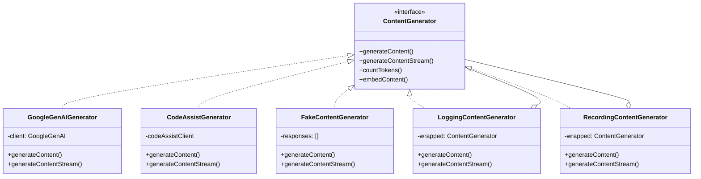

### Tool Hierarchy

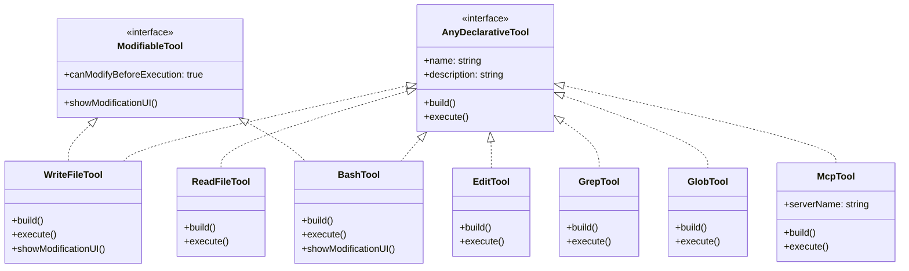

---

## Data Flow Diagrams

### Message History Management

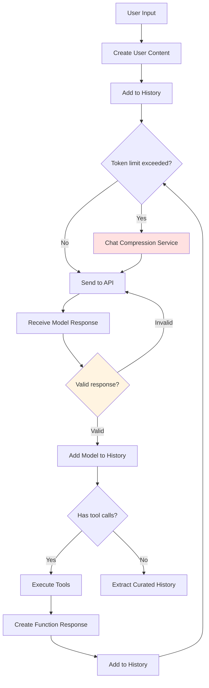

### Configuration Loading Flow

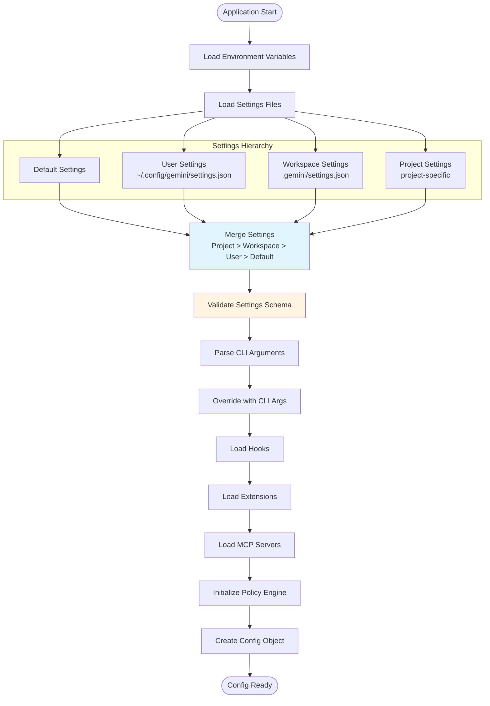

### Tool Call Resolution Flow

```mermaid
graph TB
    LLMResponse[LLM Response with Tool Calls]
    ParseCalls[Parse Function Calls]
    CreateRequests[Create ToolCallRequestInfo objects]
    QueueRequests[Queue in Scheduler]
    ProcessQueue{Process Queue}
    GetNext[Get Next Request]
    FindTool[Find Tool in Registry]
    ToolExists{Tool exists?}
    CheckAuth{Tool authorized?}
    PolicyCheck[Policy Engine Check]
    PolicyResult{Policy decision?}

    subgraph "Approval Flow"
        AutoApprove[Auto-approve]
        RequireConfirm[Require Confirmation]
        Deny[Deny]
    end

    SendConfirmReq[Send Confirmation Request]
    MessageBusEmit[MessageBus.emit]
    UIShowDialog[UI: Show Confirmation Dialog]
    WaitUser[Wait for User Response]
    UserResponse{User approves?}

    CheckModifiable{Tool modifiable?}
    ShowModUI[Show Modification UI]
    UserModifies{User modifies?}

    ExecuteTool[Execute Tool]
    HandleError[Handle Error]
    ReturnResult[Return ToolCallResponseInfo]
    MoreTools{More tools?}
    AllComplete[All Tools Complete]
    CreateModelContent[Create Model Content with Results]

    LLMResponse --> ParseCalls
    ParseCalls --> CreateRequests
    CreateRequests --> QueueRequests
    QueueRequests --> ProcessQueue

    ProcessQueue --> GetNext
    GetNext --> FindTool
    FindTool --> ToolExists

    ToolExists -->|No| HandleError
    ToolExists -->|Yes| CheckAuth

    CheckAuth -->|No| HandleError
    CheckAuth -->|Yes| PolicyCheck

    PolicyCheck --> PolicyResult

    PolicyResult --> AutoApprove
    PolicyResult --> RequireConfirm
    PolicyResult --> Deny

    Deny --> HandleError

    AutoApprove --> CheckModifiable
    RequireConfirm --> SendConfirmReq

    SendConfirmReq --> MessageBusEmit
    MessageBusEmit --> UIShowDialog
    UIShowDialog --> WaitUser
    WaitUser --> UserResponse

    UserResponse -->|No| HandleError
    UserResponse -->|Yes| CheckModifiable

    CheckModifiable -->|No| ExecuteTool
    CheckModifiable -->|Yes| ShowModUI

    ShowModUI --> UserModifies
    UserModifies -->|Cancelled| HandleError
    UserModifies -->|Modified| ExecuteTool

    ExecuteTool --> ReturnResult
    HandleError --> ReturnResult

    ReturnResult --> MoreTools
    MoreTools -->|Yes| GetNext
    MoreTools -->|No| AllComplete

    AllComplete --> CreateModelContent

    style AutoApprove fill:#90EE90
    style Deny fill:#FFB6C6
    style HandleError fill:#FFB6C6
```

---

## State Machines

### Application State Machine

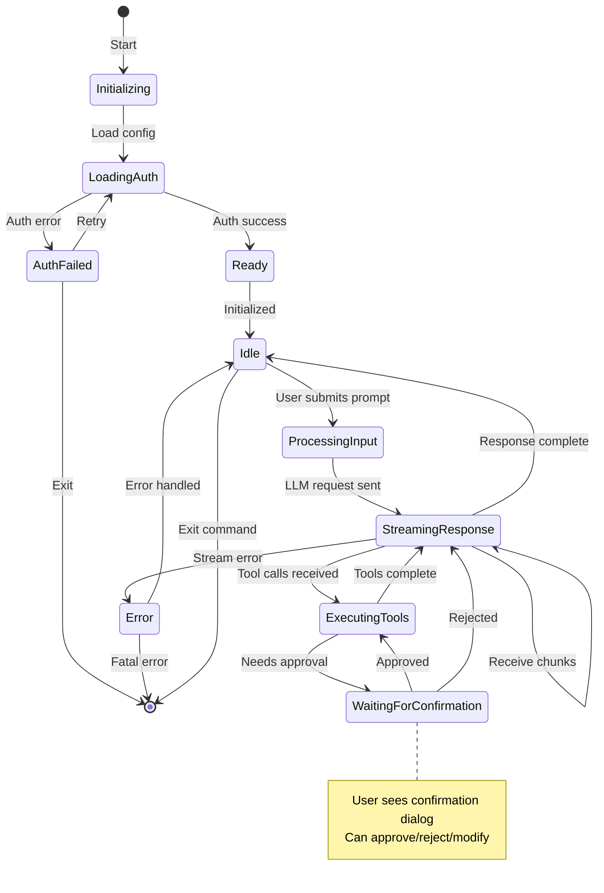

### Tool Execution State Machine

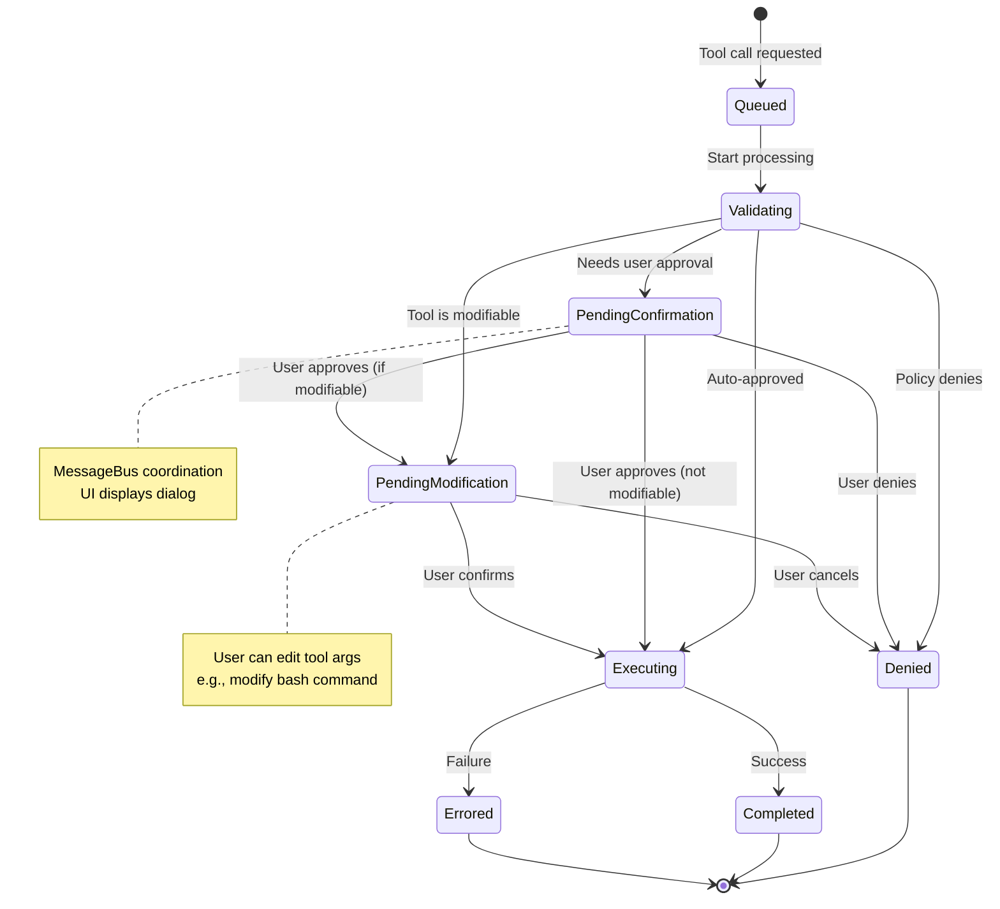

### Agent Execution State Machine

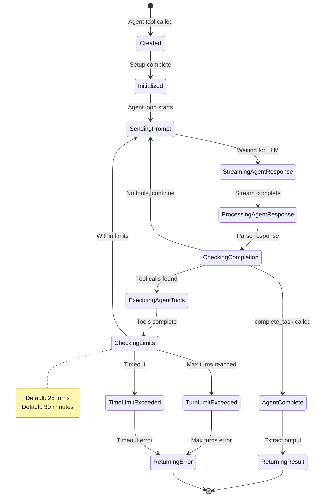

---

## Component Interaction

### Interactive Session Component Flow

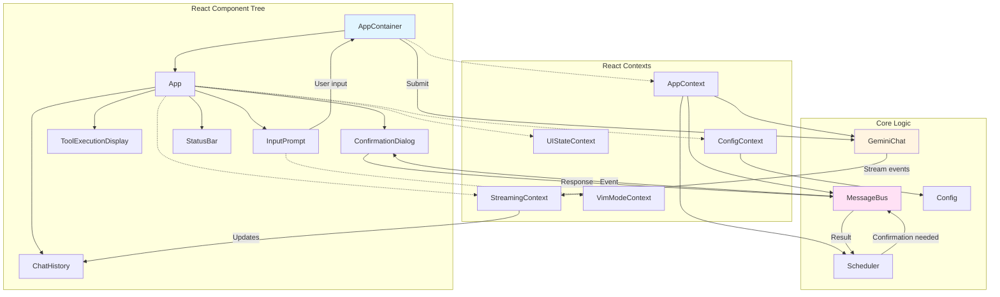

### Non-Interactive Session Flow

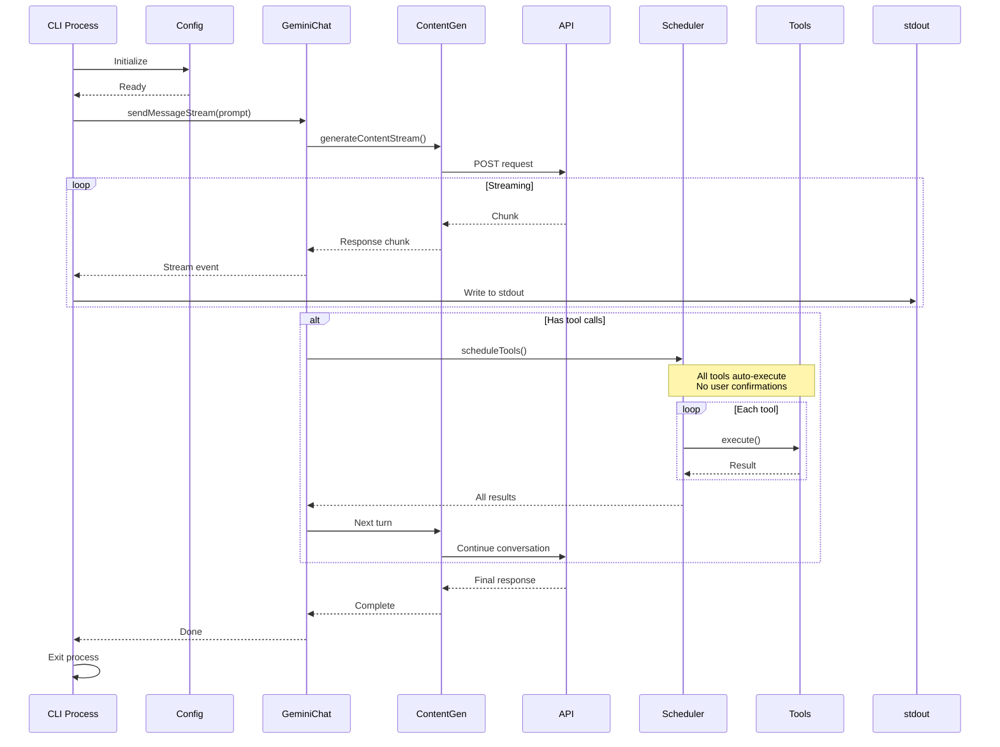

### MCP Integration Flow

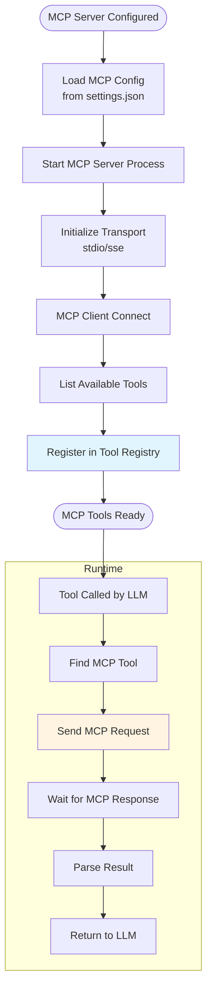

### Hook System Flow

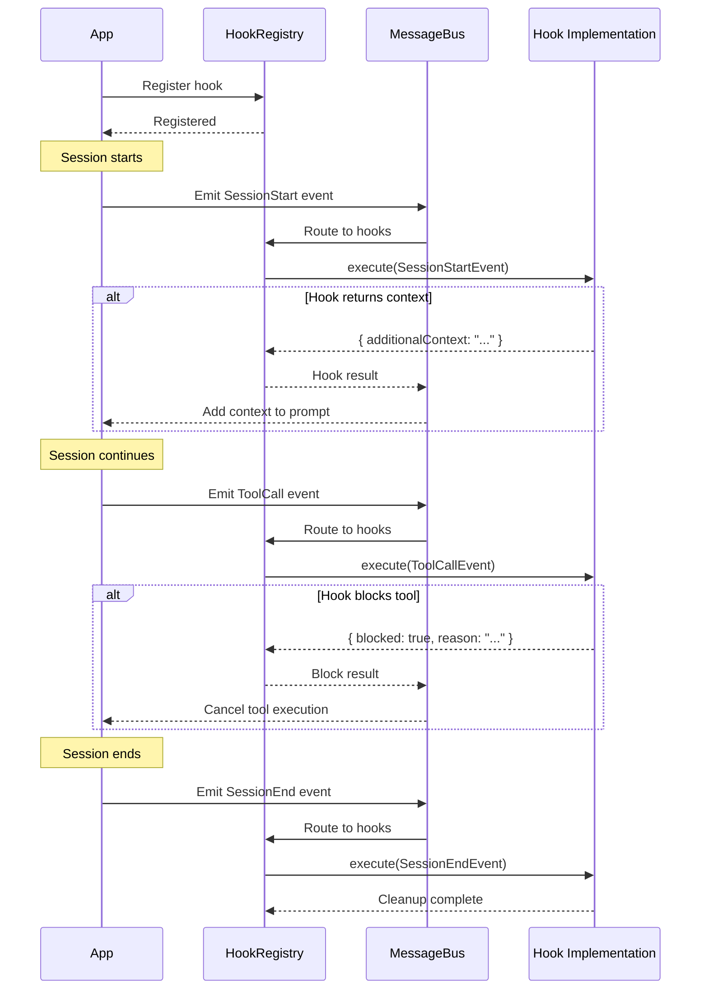

---

## Request/Response Data Structures

### GeminiChat Message Format

```mermaid
classDiagram
    class Content {
        +role: "user" | "model"
        +parts: Part[]
    }

    class Part {
        <<union>>
    }

    class TextPart {
        +text: string
    }

    class ThoughtPart {
        +thought: string
    }

    class FunctionCallPart {
        +functionCall: FunctionCall
    }

    class FunctionResponsePart {
        +functionResponse: FunctionResponse
    }

    class InlineDataPart {
        +inlineData: { mimeType, data }
    }

    class FileDataPart {
        +fileData: { mimeType, fileUri }
    }

    Content *-- Part
    Part <|-- TextPart
    Part <|-- ThoughtPart
    Part <|-- FunctionCallPart
    Part <|-- FunctionResponsePart
    Part <|-- InlineDataPart
    Part <|-- FileDataPart

    class FunctionCall {
        +name: string
        +args: object
    }

    class FunctionResponse {
        +name: string
        +response: object
    }

    FunctionCallPart *-- FunctionCall
    FunctionResponsePart *-- FunctionResponse
```

### Tool Call Lifecycle Objects

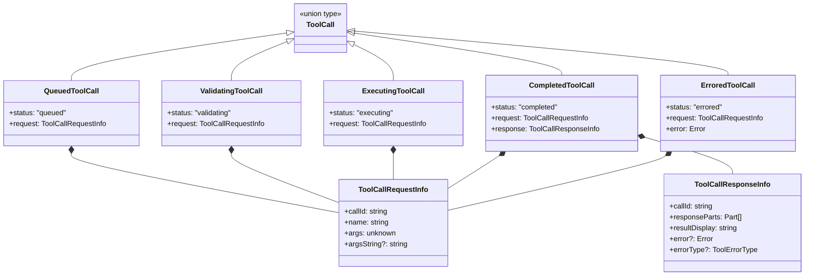

---

## Streaming Architecture

### Stream Processing Pipeline

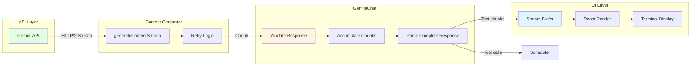

### Error Handling & Retry Flow

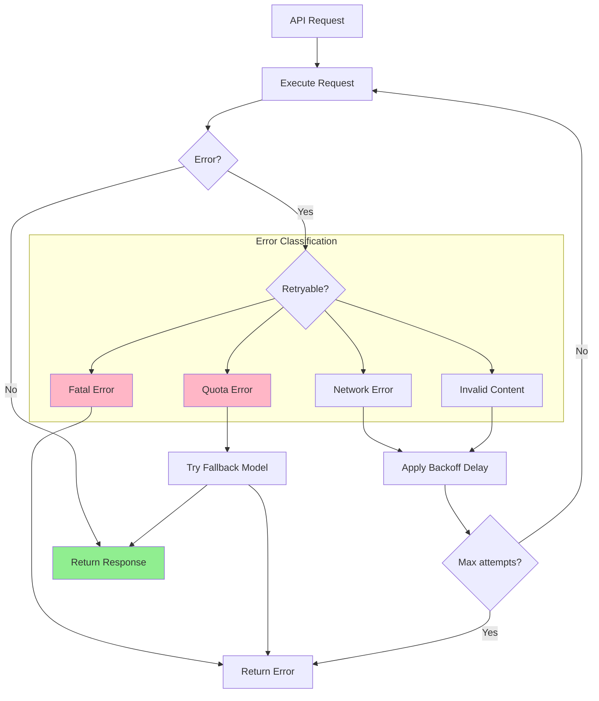

---

## Summary

This visual guide provides detailed diagrams for:
- **Package dependencies** and how they relate
- **Class hierarchies** for major components
- **Data flow** through the application
- **State machines** governing execution
- **Component interactions** in both interactive and non-interactive modes
- **Data structures** used for messages and tool calls
- **Streaming architecture** for real-time responses
- **Error handling** and retry mechanisms

Use these diagrams in conjunction with the Architecture Analysis document to navigate and understand the codebase structure and flow.
